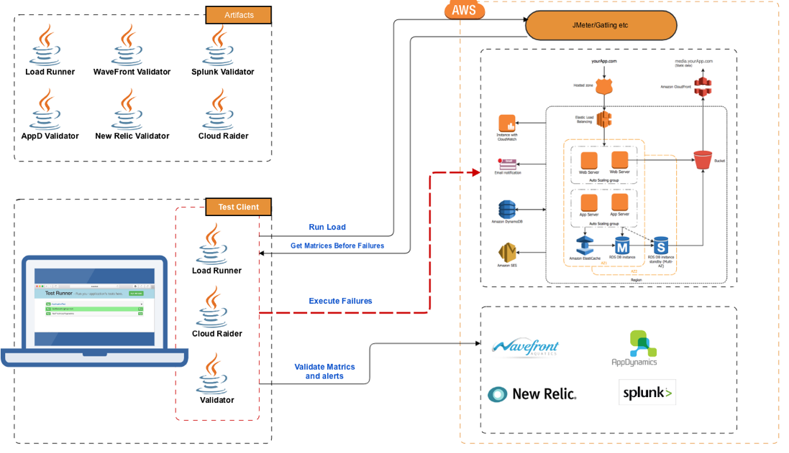

  

  

## Introduction to Cloud-Raider 

CloudRaider is a new Testing Framework to perform "Failure Mode Effect Analysis" (FMEA) testing in AWS.  Cloud Raider also provide behavior driven testing approach via Cucumber framework. Cloud Raider provides a programmatic way to execute controlled failures, and also recover quickly back to normal. As it provides BDD way to write test cases, your FMEA test plan can itself become your test cases that can be executed as is.

  

### Chaos Engineering ###
The Cucumber Client also provides functionality for running automated FMEA tests through the principles of Chaos Engineering. 
To learn more, Please review [here](ChaosFeature.md)

### Getting Started ##

#### Install JDK ###

Install Java 8 JDK
JDK 8 Doc: http://docs.oracle.com/javase/8/docs/
JDK 8 Download: http://www.oracle.com/technetwork/java/javase/downloads/jdk8-downloads-2133151.html
Java Version: JDK 1.8.0_51
You can check this by typing in the command line: java –version (Java 8 is required for the build)
Set the JAVA_HOME system environment variable to /System/Library/Frameworks/JavaVM.framework/Versions/CurrentJDK/Home
Add $JAVA_HOME to the PATH system environment variable
#### Install Maven ###

Maven 3.0.x is available by default in Mac OS X(3.0.3 in Lion,3.0.2 in Snow Leopard after Java for Mac OS X 10.6 update 4)
Verify this using mvn –version from the command line
To upgrade to Maven 3.2.1, do the following
Download the Maven 3.2.1 binary zip from http://maven.apache.org/download.html.
Unzip the downloaded file (apache-maven-3.2.1-bin.zip) to the desired location (e.g., /Applications).
Set the M2_HOME system environment variable to the installation directory (e.g., /Applications/apache-maven-3.2.1).
Prepend $M2_HOME/bin to the PATH system environment variable.
From the command line, verify that Maven has been installed correctly: mvn --version

#### AWS Credentials ###
A prerequisite to running any of the test cases above is, setting up AWS credentials. For details on how to setup credentials please follow http://docs.aws.amazon.com/sdk-for-java/v1/developer-guide/credentials.html
For testing with credentials profile files, update ~/.aws/credentials and ~/.aws/config files.
The validator uses the standard as credentials resolving chain. This means that we can use environment variables such as AWS_DEFAULT_PROFILE or command line such as aws.profile. see aws docs for all options and syntax

#### Test Client  ###
Please use the example test module to get familiar about how to create and execute test cases

Credentials can be provided in config, Environment variables or the standard .aws/config file

##### Cucumber Example
Please review [here](cucumber-example/README.md)

##### Java Example
Please review [here](java-example/README.md)

#### Installing Cucumber Plugin ###
##### IntelliJ
    https://www.jetbrains.com/help/idea/cucumber.html
##### Eclipse
    https://shankargarg.wordpress.com/2016/05/15/integrating-eclipse-with-cucumber-natural-plugin/

##### AWS Simple System Manager
CloudRaider supports execution of commands on EC2 hosts via AWS Simple System Manager (SSM)
You can find more information about SSM [here](https://docs.aws.amazon.com/systems-manager/latest/userguide/ssm-agent.html)

