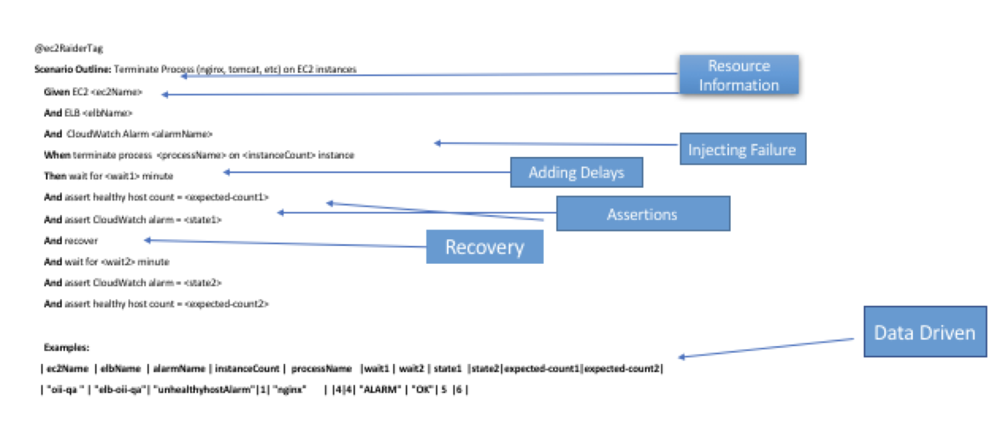

<div align="center">
  
</div>

# cloud-raider-cucumber-client

Cloud Raider Cucumber client leverages Gherkin/Cucumber's behavior driven development for FMEA testing. The test specifications are written in plain text which are stored in feature files. The specifications consists of multiple scenarios which follow some basic syntax rules.
Cucumber overview can be found here: https://docs.cucumber.io/guides/overview/

## Example
<a href=""></a>

## Getting Started: ##

### Install JDK: ###

Install Java 8 JDK
JDK 8 Doc: http://docs.oracle.com/javase/8/docs/
JDK 8 Download: http://www.oracle.com/technetwork/java/javase/downloads/jdk8-downloads-2133151.html
Java Version: JDK 1.8.0_51
You can check this by typing in the command line: java –version (Java 8 is required for the build)
Set the JAVA_HOME system environment variable to /System/Library/Frameworks/JavaVM.framework/Versions/CurrentJDK/Home
Add $JAVA_HOME to the PATH system environment variable

### Install Maven: ###

Maven 3.0.x is available by default in Mac OS X(3.0.3 in Lion,3.0.2 in Snow Leopard after Java for Mac OS X 10.6 update 4)
Verify this using mvn –version from the command line
To upgrade to Maven 3.2.1, do the following
Download the Maven 3.2.1 binary zip from http://maven.apache.org/download.html.
Unzip the downloaded file (apache-maven-3.2.1-bin.zip) to the desired location (e.g., /Applications).
Set the M2_HOME system environment variable to the installation directory (e.g., /Applications/apache-maven-3.2.1).
Prepend $M2_HOME/bin to the PATH system environment variable.
From the command line, verify that Maven has been installed correctly: mvn --version
### AWS Credentials: ###

A prerequisite to running any of the test cases above is, setting up AWS credentials. For details on how to setup credentials please follow http://docs.aws.amazon.com/sdk-for-java/v1/developer-guide/credentials.html
For testing with credentials profile files, update ~/.aws/credentials and ~/.aws/config files.
The validator uses the standard as credentials resolving chain. This means that we can use environment variables such as AWS_DEFAULT_PROFILE or command line such as aws.profile. see aws docs for all options and syntax

### Installing Cucumber Plugin ###
#### IntelliJ
    https://www.jetbrains.com/help/idea/cucumber.html
#### Eclipse
    https://shankargarg.wordpress.com/2016/05/15/integrating-eclipse-with-cucumber-natural-plugin/

#### Cucumber Version 
2.3.1 is supported version for this client impletementation

#### Client Confirguration with AWS credentials
In src/test/resources/config.properties configure the following properties

```
aws.ec2.privateKeyPath=/path/to/pem file <myaccount.pem>
aws.ec2.bastionIp=<IP or DNS Name for bastion>
aws.region=us-west-2 or <any other region>
aws.ec2.username=ec2-user
aws.profile=<pre-prod provile>

```
or for non profile related setup, configure the following properties:
```
aws.accessKeyId=<AWS Access Key>
aws.secretKey=<AWS Secret>
```
if there is a passphrase for ssh key than set the property below

```
aws.ec2.privateKeyPassPhrase=
```
## Test Execution

### Running Feature file
Tests can be executed within IDE by execution of `*.feature` file via cucumber pluggin.  

### Running With TestNG
To run a script `*.feature` file from your Java IDE, you just need the following empty test-class in the same package. The name of the class doesn't matter, and it will automatically run any `*.feature` file in the same package. This comes in useful because depending on how you organize your files and folders - you can have multiple feature files executed by a single JUnit test-class.

```java
package com.intuit.tools.fmea.client.cucumber;


import cucumber.api.CucumberOptions;
import cucumber.api.junit.Cucumber;
import cucumber.api.testng.AbstractTestNGCucumberTests;
import org.junit.runner.RunWith;


@RunWith(Cucumber.class)
@CucumberOptions (
        monochrome = true,
        features = "src/test/features",
        plugin = {"pretty", "html:target/surefire-reports/cucumber-html-report", "json:target/surefire-reports/cucumber-results.json", "junit:target/surefire-reports/cucumber-results.xml"},
        tags = "@EC2Failure",
        glue = "com.intuit.fmea.cucumber.steps"
)
public class EC2FailureCucumberTest extends AbstractTestNGCucumberTests {

}

```

Refer to your IDE documentation for how to run a JUnit class.  Typically right-clicking on the file in the project browser or even within the editor view would bring up the "Run as JUnit Test" menu option.

### HTML report
An HTML report is output to the `target/surefire-reports` folder 


## Cucumber Options
To run only a specific feature file from a test even if there are multiple `*.feature` files in the same folder (or sub-folders), use the [`@CucumberOptions`](https://cucumber.io/docs/reference/jvm#configuration) annotation.

```
java
package com.intuit.tools.fmea.client.cucumber;


import cucumber.api.CucumberOptions;
import cucumber.api.junit.Cucumber;
import cucumber.api.testng.AbstractTestNGCucumberTests;
import org.junit.runner.RunWith;


@RunWith(Cucumber.class)
@CucumberOptions (
        monochrome = true,
        features = "src/test/features",
        plugin = {"pretty", "html:target/surefire-reports/cucumber-html-report", "json:target/surefire-reports/cucumber-results.json", "junit:target/surefire-reports/cucumber-results.xml"},
        tags = "@EC2Failure",
        glue = "com.intuit.fmea.cucumber.steps"
)
public class EC2FailureCucumberTest extends AbstractTestNGCucumberTests {

}
```

And most convenient of all, you can even point to a directory (or package). Combine this with [tags](#test-suites) to execute multiple features, without having to list every one of them.

```java
@CucumberOptions (
        monochrome = true,
        features = "src/test/features",
        plugin = {"pretty", "html:target/surefire-reports/cucumber-html-report", "json:target/surefire-reports/cucumber-results.json", "junit:target/surefire-reports/cucumber-results.xml"},
        tags = "@EC2Failure",
        glue = "com.intuit.cloudraider.cucumber.steps"
)
```


## Command Line
Normally in dev mode, you will use your IDE to run a `*.feature` file directly or via the companion 'runner' JUnit Java class. When you have a 'runner' class in place, it would be possible to run it from the command-line as well.

Note that the `mvn test` command only runs test classes that follow the `*Test.java` 

To run scenarios with @feature1 and @feature2 tags:
```
mvn test -Dcucumber.options="--tags @feature1 --tags @feature2"
```
To run scenarios with @feature1 or @feature2:
```
mvn test -Dcucumber.options="--tags @feature1,@feature2"
```

### Troubleshooting Cucumber IDE Support
* On Eclipse you may see warnings such as `Step 'xxx' does not have a matching glue code` or `required(..)+ loop did not match anything at input Scenario:`, and on IntelliJ: `Unimplemented substep definition`. 
  ### Eclipse Solution
   Eclipse --> Preferences --> Cucumber --> User Settings

   In the text-field for "Add Root Package Name .." enter com.intuit.fmea.cucumber.steps

   In some cases, even this does not work. Then go to the "Run Configuration" for the feature you were attempting to run and    use com.intuit.fmea.cucumber.steps instead of classpath: for the 'Glue'.

  ### IntelliJ
   If you are trying to execute Feature file than edit configuration and set glue to "com.intuit.fmea.cucumber.steps"

   IntelliJ 14.1.3 or higher have reported that execution fails with Exception in thread "main" java.lang.NoClassDefFoundError: org/springframework/transaction/TransactionDefinition.
   
   The cause is incorrect detection of the Glue property, for some reason the package cucumber.api.spring is added incorrectly.  Edit run configuration and remove "cucumber.api.spring" from glue and make sure glue is set to "com.intuit.cloudraider.cucumber.steps"


# Feature File Example
```
@fmeaFailure
@EC2Failure

Feature: EC2 Failure

  Scenario Outline: hello Process(nginx, tomcat, ..) Failure and Recovery
    Given EC2 <ec2Name>
    And ALB <elbName>
    And  CloudWatch Alarm <alarmName>
    When terminate process  <processName> on <instanceCount> instance
    Then wait for <wait1> minute
    And assert healthy host count = <expected-count1>
    And assert CloudWatch alarm = <state1>
    And recover
    And wait for <wait2> minute
    And assert CloudWatch alarm = <state2>
    And assert healthy host count = <expected-count2>

    @e2e
    Examples:
      | ec2Name         | elbName     | alarmName                       |instanceCount |  processName   | |wait1 | wait2 | state1 | state2| expected-count1|expected-count2|
      | "hello-a-fe-e2e" | "hello-a-fe-e2e"| "hello-a-fe-e2e-UnHealthyHosts" | 1| "nginx"       | |4|4| "ALARM" | "OK"| 5  |6 |
```
      
Explanation of each of the keywords can be found at https://docs.cucumber.io/gherkin/reference/ 

# Step Definitions
For each of the scenario to be processed a corresponding step definition is required. Each step definition is a java method that maps to the cucumber steps. The step definitions for the scenarios are in the Cloud-Raider library.


## Index 

:white_small_square: | :white_small_square: | :white_small_square:  
----- | ---- | ---- 
**AWS Resource Type** | **STEP DEFINITION** | **PURPOSE** 
Application Load Balancer |  ```Given ALB <string> ```| This will set the name of Application Load Balancer and fetch healthy EC2 Intances
Classic Load Balancer |  ```Given ELB <string> ```| This will set the name of Classic Load Balancer (ELB) and fetch healthy EC2 Intances
Network Load Balancer |  ```Given NLB <string> ```| This will set the name of Network Load Balancer and fetch healthy EC2 Intances
EC2|```Given EC2 <string> ```| This step definition will pick up ec2 instance for given name tag
